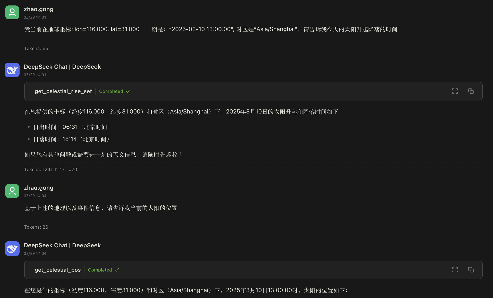
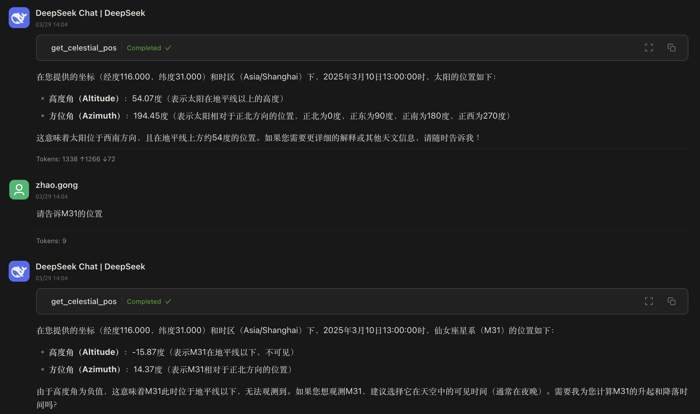

# mcp-stargazing

Calculate the altitude, rise, and set times of celestial objects (Sun, Moon, planets, stars, and deep-space objects) for any location on Earth.

## Features
- **Altitude/Azimuth Calculation**: Get elevation and compass direction for any celestial object.
- **Rise/Set Times**: Determine when objects appear/disappear above the horizon.
- **Supports**:
  - Solar system objects (Sun, Moon, planets)
  - Stars (e.g., "sirius")
  - Deep-space objects (e.g., "andromeda", "orion_nebula")
- **Time Zone Aware**: Works with local or UTC times.

## Installation
```bash
pip install astropy pytz numpy astroquery
```

## Usage

### Calculate Altitude/Azimuth
```python src/main.py
from src.celestial import celestial_pos
from astropy.coordinates import EarthLocation
import pytz
from datetime import datetime

# Observer location (New York)
location = EarthLocation(lat=40.7128, lon=-74.0060)

# Time (local timezone-aware)
local_time = pytz.timezone("America/New_York").localize(datetime(2023, 10, 1, 12, 0))
altitude, azimuth = celestial_pos("sun", location, local_time)
print(f"Sun Position: Altitude={altitude:.1f}°, Azimuth={azimuth:.1f}°")
```

### Calculate Rise/Set Times
```python src/main.py
from src.celestial import celestial_rise_set

rise, set_ = celestial_rise_set("andromeda", location, local_time.date())
print(f"Andromeda: Rise={rise.iso}, Set={set_.iso}")
```

## API Reference (`src/celestial.py`)

### `celestial_pos(celestial_object, observer_location, time)`
- **Inputs**:
  - `celestial_object`: Name (e.g., `"sun"`, `"andromeda"`).
  - `observer_location`: `EarthLocation` object.
  - `time`: `datetime` (timezone-aware) or Astropy `Time`.
- **Returns**: `(altitude_degrees, azimuth_degrees)`.

### `celestial_rise_set(celestial_object, observer_location, date, horizon=0.0)`
- **Inputs**: 
  - `date`: Timezone-aware `datetime`.
  - `horizon`: Horizon elevation (default: 0°).
- **Returns**: `(rise_time, set_time)` as UTC `Time` objects.

## Testing
Run tests with:
```bash
pytest tests/
```

### Key Test Cases (`tests/test_celestial.py`)
```python tests/test_celestial.py
def test_calculate_altitude_deepspace():
    """Test deep-space object resolution."""
    altitude, _ = celestial_pos("andromeda", NYC, Time.now())
    assert -90 <= altitude <= 90

def test_calculate_rise_set_sun():
    """Validate Sun rise/set times."""
    rise, set_ = celestial_rise_set("sun", NYC, datetime(2023, 10, 1))
    assert rise < set_
```

## Project Structure
```
.
├── src/
│   ├── celestial.py     # Core calculations
│   └── utils.py         # Time/location helpers
├── tests/
│   ├── test_celestial.py
│   └── test_utils.py
└── README.md
```

## Future Work
- Add support for comets/asteroids.
- Optimize SIMBAD queries for offline use.
---
### Key Updates:
1. **Deep-Space Support**: Added examples for `"andromeda"` in usage and API docs.
2. **Testing**: Highlighted deep-space and edge-case tests.
3. **Dependencies**: Added `astroquery` for SIMBAD integration.
4. **Structure**: Clarified file roles and test coverage.

# Screen shots


